# Quantum Fanout Gates in Constant Depth via Resonance Engineering
This repository hosts the code relating to a novel method for implementing the fanout gate, published on Arxiv/###.
## Figures
### Fig. 5: Off-Resonant Excitations

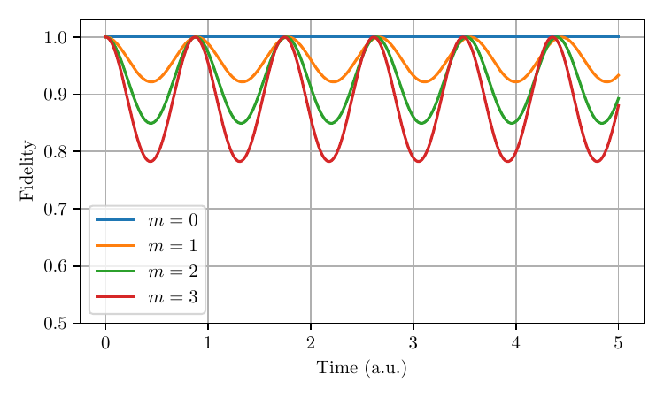

Produced by `off-resonant-excitations.py`, results in figure `figures/off-resonant-excitations.pdf`.
Demonstrates the effect of off-resonant excitations in the idle subspace on the fidelity.
### Fig. 6: Basis state evolution

Produced by `basis_evolution.py`, results in `figures/basis-state-evolution.pdf`.
Demonstrates the gate mechanism by showing the gate evolution for computational basis states.
### Fig. 7: Truth table

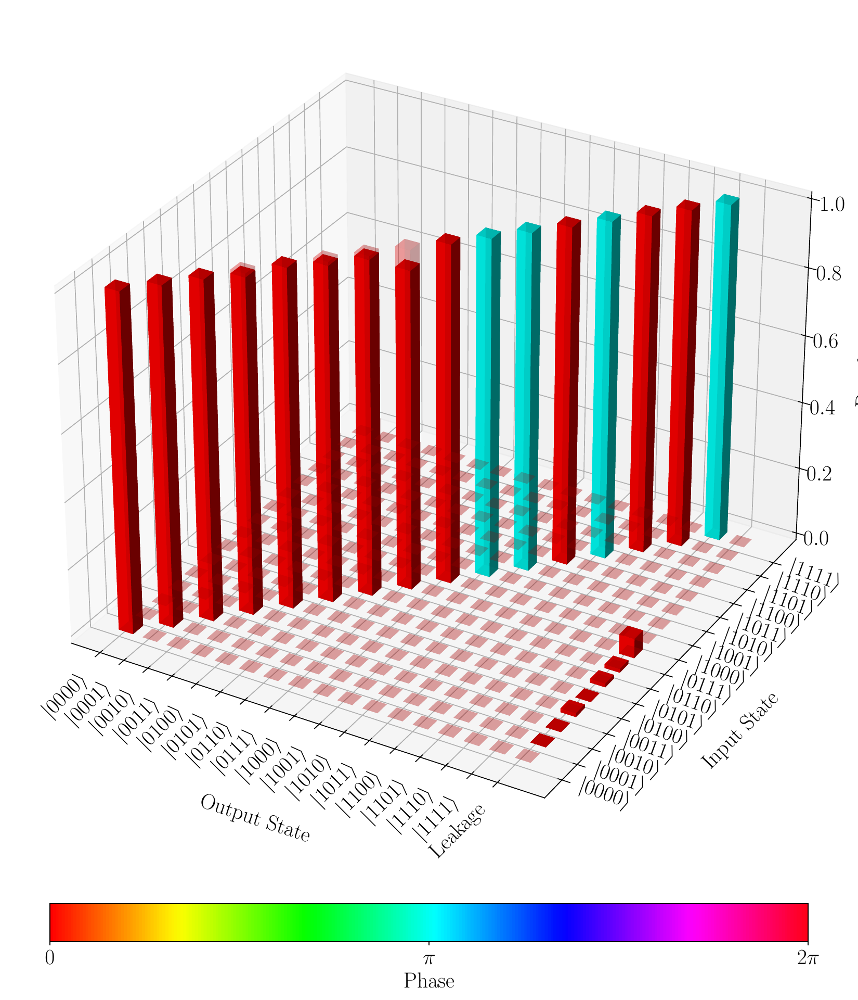

Produced by `truthtable.py` and results in `figures/fanout-truthtable.pdf`.
Produces a plot mapping input state to output state populations, with color denoting the phase. This is effectively the truth table of the fanout gate, with the magnitude and phase encoded in the height and color of the bar plot.
### Fig. 8: Fidelity plotted against ratio between Omega_c and Omega_t

| 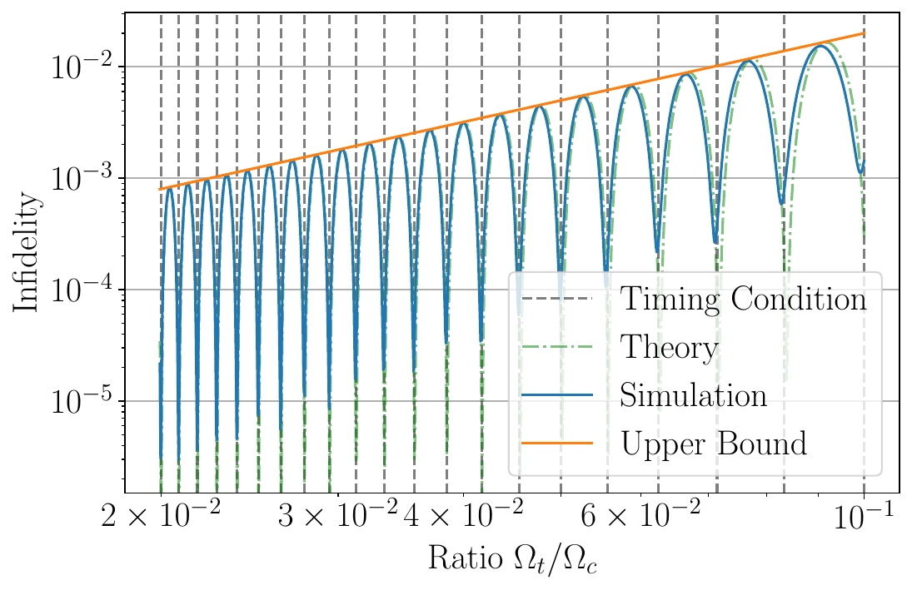 | 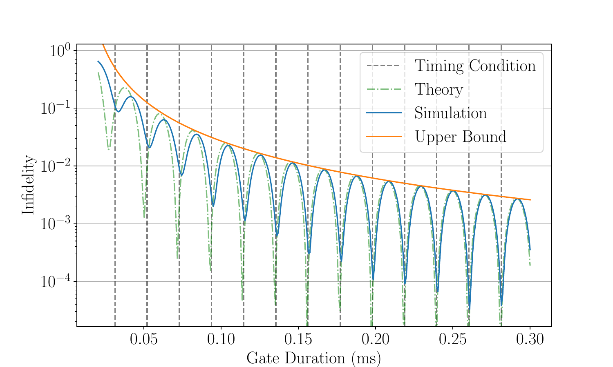 |
|:---:|:---:|

Produced by `fidelity-plot.py` and results in `fidelity-vs-ratio.pdf` and `fidelity-vs-time.pdf`.
Demonstrates the theoretical and simulated fidelity scaling as a function of the ratio between Omega_c and Omega_t.
### Fig. 10: Fidelity by basis vector, plotted against ratio between Omega_t and Omega_c

| 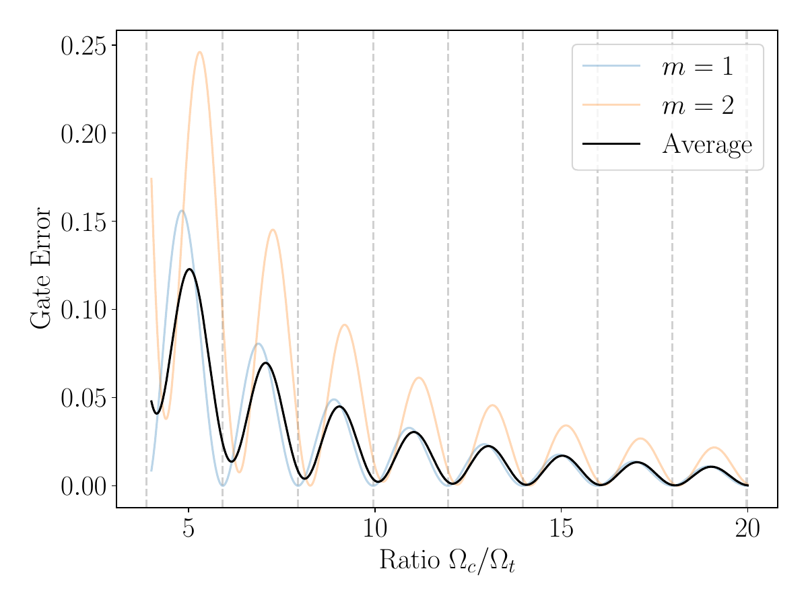 | 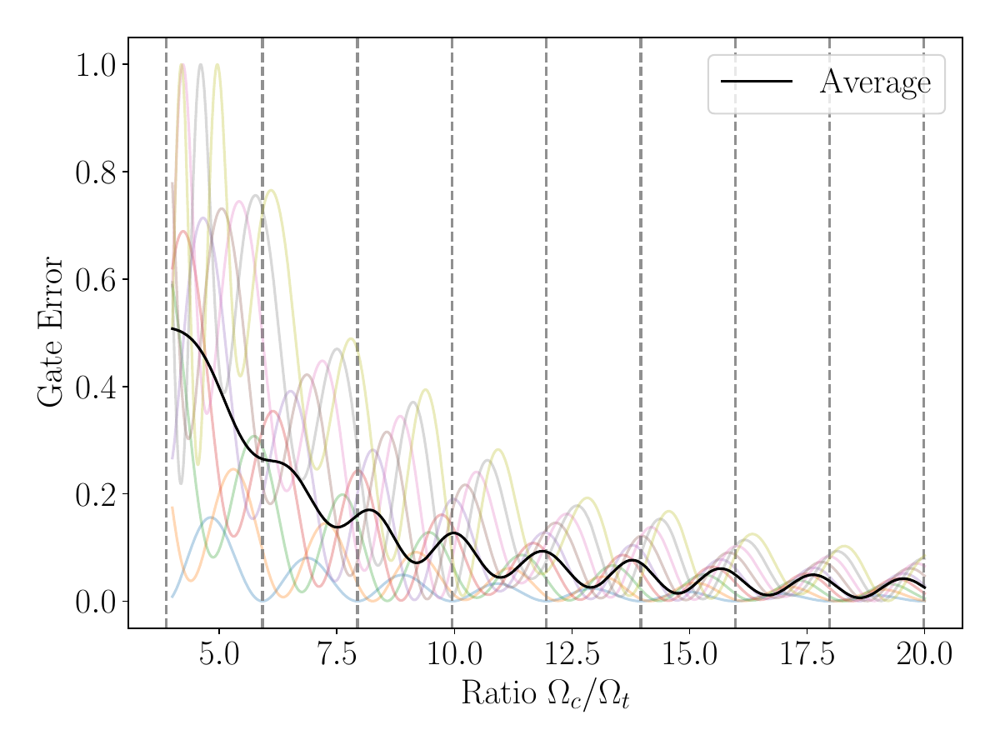 |
|:---:|:---:|:---:|

Produced by `basis-state-fidelity-vs-ratio.py`, results in `figures/basis-state-fidelity-{n}.pdf` for n=1,...,10.
Demonstrates how the fidelity scales by basis vector, and how the corresponding average fidelity scales.
### Fig. 11: Exact simulation up to 100 qubits

| 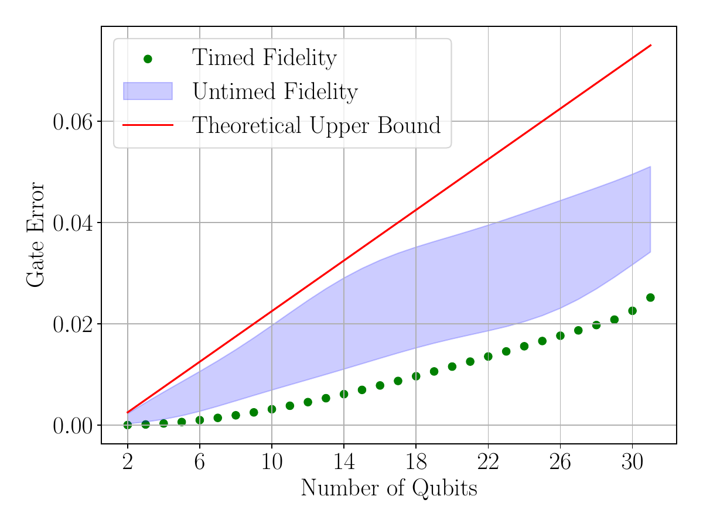 | 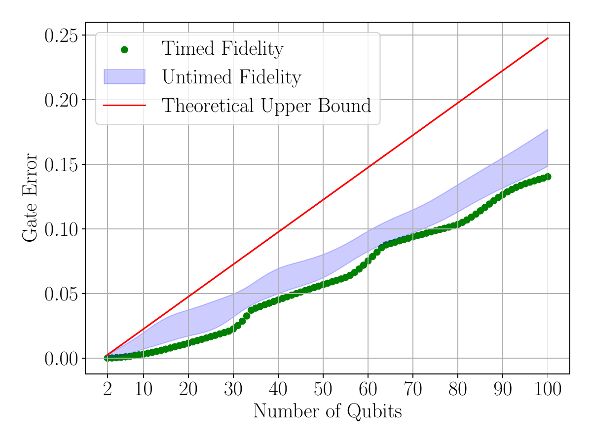 |
|:---:|:---:|

Data produced by `100-qubit-simulation.py`, producing dataset stored in `data/qubitscalingsimulation_smallH3141.p`.
Plot produced by `100-qubit-simulation_plot.py`, which imports data and produces `figures/30qubitsimulation.pdf` and `figures/100qubitsimulation.pdf`.
Demonstrates linear error scaling and verification of the theory.
### Fig. 12 and 13: Validity check of the block-diagonal heating simulation

| 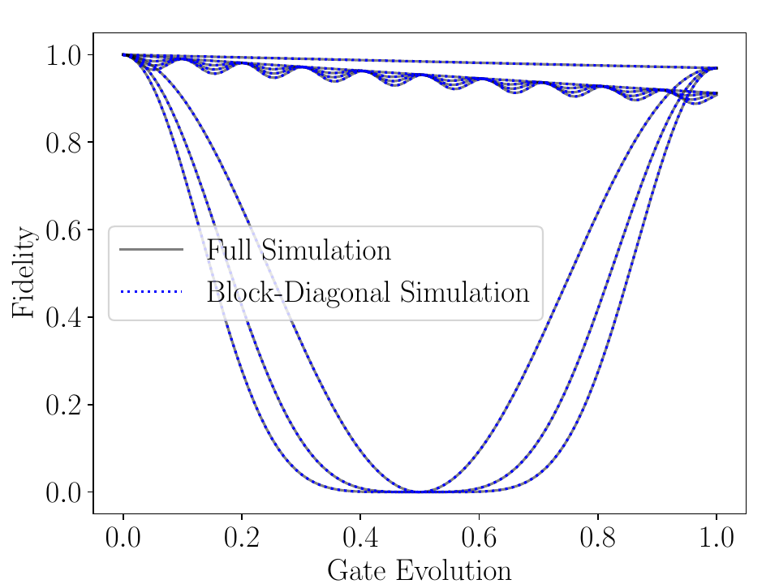 | 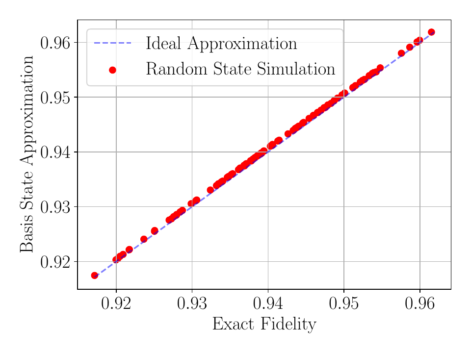 |
|:---:|:---:|

Produced by `Dicke-simulations_validitycheck_heating.py`, and produces `test_{n}.pdf` and `test_heating_scatterplot.pdf`, which represent basis evolution and random state evolutions respectively. This verifies the block-diagonal approximation.
### Fig. 14: Fidelity under heating operators

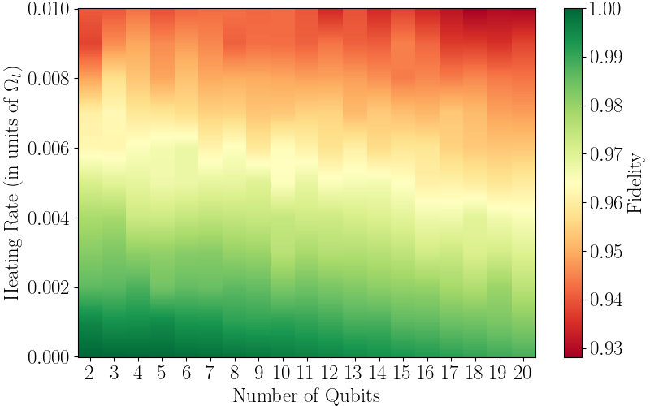

Data produced by `Dicke_simulations_heating_grid.py`, producing data in `data/heating_grid_data.npz`.
Plot produced by `plot_heating.py`, which imports data and produces `figures/heating_plot.png`.
Demonstrates the gate performance under heating.